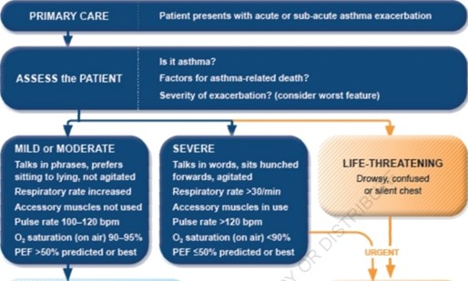

# Definition of asthma exacerbations:

Exacerbations of asthma are episodes characterized by a progressive increase in symptoms of shortness of breath, cough, wheezing or chest tightness and progressive decrease in lung function.

# Common exacerbation triggers include:

* Viral respiratory infections
* Allergen exposure eg: grass pollen, soy bean dust, fungal spores
* Food allergy
* Outdoor air pollution.

# Identifying patients at risk of asthma-related death:

In addition to factors known to increase the risk of asthma exacerbations , some features are specifically associated with an increase in the risk of asthma-related death . The presence of one or more of these risk factors should be quickly identifiable in the clinical notes, and these patients should be encouraged to seek urgent medical care early in the course of an exacerbation.

# Factors that increase the risk of asthma-related death:

* A history of near-fatal asthma.
* Hospitalization or emergency care visit for asthma in the past year.
* Currently using or having recently stopped using oral corticosteroids.
* Not currently using inhaled corticosteroids.
* Over-use of SABAs.
* A history of psychiatric disease or psychosocial problems.
* Food allergy in a patient with asthma.
* Several comorbidities including pneumonia, diabetes and arrhythmias.

DIAGNOSIS OF EXACERBATIONS:
Exacerbations represent a change in symptoms and lung function from the patient’s usual status. The decrease in expiratory airflow can be quantified by lung function measurements such as peak expiratory flow (PEF) or forced expiratory volume in 1 second (FEV1), compared with the patient’s previous lung function or predicted values.
 
In the acute setting, these measurements are more reliable indicators of the severity of the exacerbation than symptoms. The frequency of symptoms may, however, be a more sensitive measure of the onset of an exacerbation than PEF.

